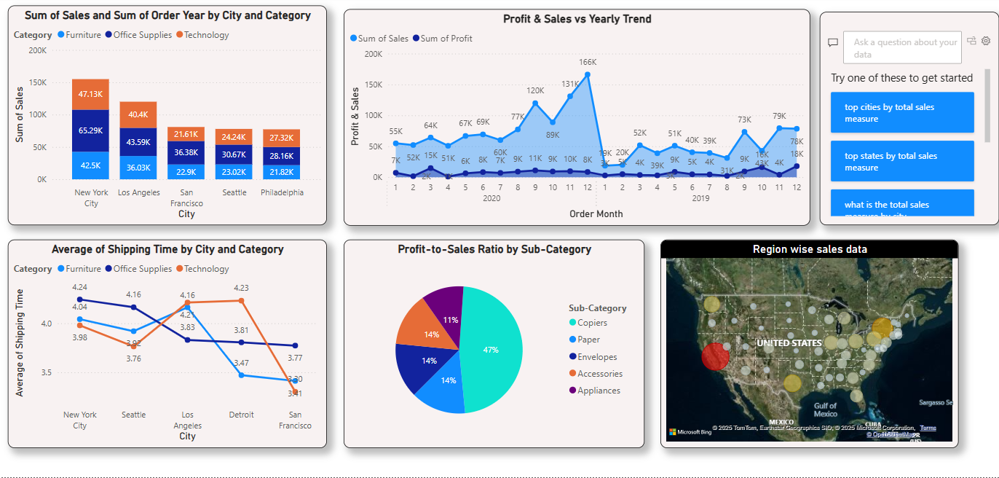

# 📊 Power BI Business Analytics Dashboard

A comprehensive interactive dashboard developed in **Power BI**, designed to analyze transactional sales data, uncover shipping inefficiencies, and forecast business trends. This project demonstrates my end-to-end capabilities in **data integration, modeling, analytics, and visualization**, along with the use of **AI-powered Copilot** for auto-generating business insights.

---

## 🧠 Project Overview

This dashboard empowers users with actionable insights into:

- Regional sales performance and trends  
- Profit-to-sales efficiency by category and sub-category  
- Shipping delay patterns across product lines  
- Quarterly sales forecasting using time intelligence  
- Auto-generated business insights via Copilot

---

## 📂 Data Sources

Data was sourced from **Kaggle** and other open repositories, including:

- Sales transactions (orders, profit, shipping time)  
- Product and sub-category metadata  
- Regional and customer demographic information  

All datasets were transformed and merged within Power BI using **Power Query**, and relationships were defined in a **star schema model**.

---

## 🛠️ Tech Stack

- **Power BI Desktop**  
- **Power Query (M Language)**  
- **DAX** (Data Analysis Expressions)  
- **SQL (for validation)**  
- **Copilot for auto-generated insights**

---

## 🔧 Key Features & Implementation

### 🔹 Data Integration & Modeling
- Connected and cleaned multiple CSV data sources
- Normalized structure into fact and dimension tables
- Built a star schema for efficient data relationships

### 🔹 Data Transformation
- Applied filtering, joins, type casting, and calculated columns
- Created clean, analysis-ready data for dashboard consumption

### 🔹 Advanced DAX
- Computed KPIs like:
  - Profit-to-Sales Ratio  
  - YoY Trends  
  - 3-Day Shipping Delay Average  
- Applied **Time Intelligence** for dynamic period-over-period comparison

### 🔹 Visualizations
- Dynamic bar/line charts, pie charts, and **map-based geospatial insights**
- **Drill-down filters** and **category-based segmentation**

### 🔹 Forecasting & AI Insights
- Implemented **forecasting visuals** using built-in analytics
- Enabled **Power BI Copilot** to generate natural language summaries & key takeaways

---

## 📸 Screenshots

### 🔻 Dashboard Overview

                                                                                                             
